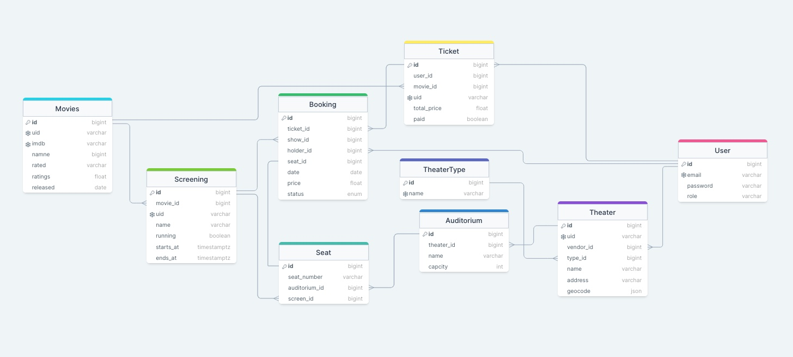
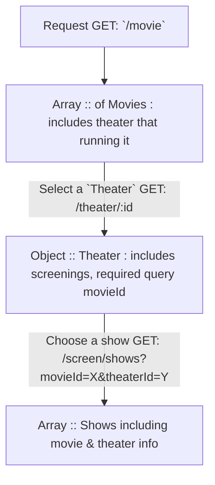
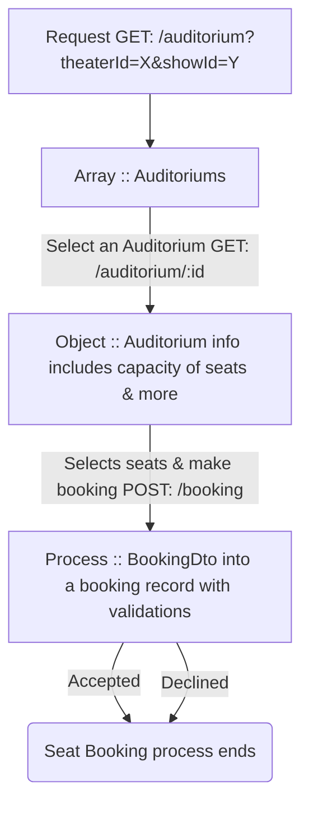

# CineBook - Theater's online ticket booking

### Backend API - AdonisJs (v5) + PostgreSQL

> This is only the backend application to serve the server-side logics and processed APIs to the client applications like website or mobile apps.

##### Database Diagram `ERD` [initial]

> Corrections are coming soon.



##### Application workflows

> Just demonstrating the basic workflow of this application

**Latest Movies & Select a Show**



**Book a seat for the selected show**



**Some necessary hints**

```typescript
// Seat :: BookingDto
/**
 * @User by authentication automatically grabs the 'userId' of users/customer
 */
interface BookingDto {
  showId: number // selected: screening (i.e. Movie(1): Morning show 6AM to 10AM)
  auditoriumId: number // selected: auditorium (i.e. SuperComfortAC-5)
  date: string // i.e. '2023-12-24' YYYY-MM-DD
  seats: string[] // i.e. ['A12', 'A13', 'A14']
}

// Example Record: Accepted
/**
 * @Unique Set: ['showId', 'seatNumber', 'auditoriumId', 'date']
 * @Combination this Set makes sure that there is no duplicate record of booking
 */
const bookingRecords = [
  // each row <--> per seat
  {
    id: 1,
    userId: 777, // user-id @customer
    showId: 1, // screening
    seatNumber: 'A12', // each seat number
    auditoriumId: 2, // auditorium
    date: '2023-12-24', // YYYY-MM-DD
    status: 'pending', // status @enum ['pending', 'booked', 'available']
  },
  // ... more like this
]
```

###### Motivation

When I was preparing myself and trying to make some good portfolios that can make impression, I thought about many like e-commerce, rental, and some others as quite popular among new developers like me.

Later I decided to make some little & unique things from others to make a small difference. Then I choose this idea. Because, its quite different from any regular new developer's portfolio showcase.

###### More information

This application serves `JSON` API only. I'm using a very good node.js based framework called `AdonisJs` and `PostgreSQL` database for this.

```yml
Runtime: Nodejs (>= 18.x) :: LTS preferred
Framework: AdonisJs (v5)
Databases: [
  PostgreSQL, # As primary database
  Redis, # As system data helper
]
DbDriver: Lucid ORM (knex.js)
TypeSafe: YES <TypeScript>
Authentication: @adonisjs/auth
Authorization: @adonisjs/bouncer (policy)
Email: @adonisjs/mailer (smtp) + mjml
Docs: Swagger (OpenApi v3)
Test: @japa # adonisjs uses Japa
Storage: @adonisjs/drive-s3 # MinIO or AWS S3
```

> Note: This is a portfolio or prototype based backend api based application with NodeJs-stack. For more info, please contact me @mahabubx7 [`iosmahabub@gmail.com`]
